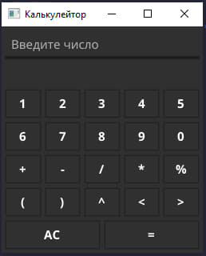
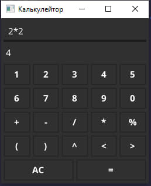
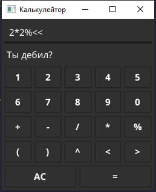
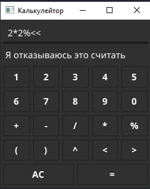

# GUI Калькулейтор




## Структура проекта

```bash
├── Makefile # Makefile для удобного запуска
├── README.md
├── bin # папка с бинарниками
│   ├── caluleitor    
│   └── caluleitor.exe
├── go.mod # файл с зависимостями
├── go.sum
├── imgs
├── logs # папка с логами (создаётся автоматически)
│   └── calc-log.log
└── main.go # точка входа
```

## Как арбайтен?

Исполняемые файлы лежат в директории `bin/`

```
├── bin # папка с бинарниками
│   └── caluleitor.exe # для Windows
```

Для выполнения программы запустите файл `bin/caluleitor.exe`

Если есть [make](https://www.gnu.org/software/make/#download)

```
# Variables
appname = caluleitor

# Actions
Default:
	go run main.go
start:
	./bin/$(appname)
run:
	go build -o bin/caluleitor.exe main.go
win:
	./bin/$(appname).exe
build:
	go build -o bin/$(appname) main.go
```

### P.s
### осторожно, он немного ругается



